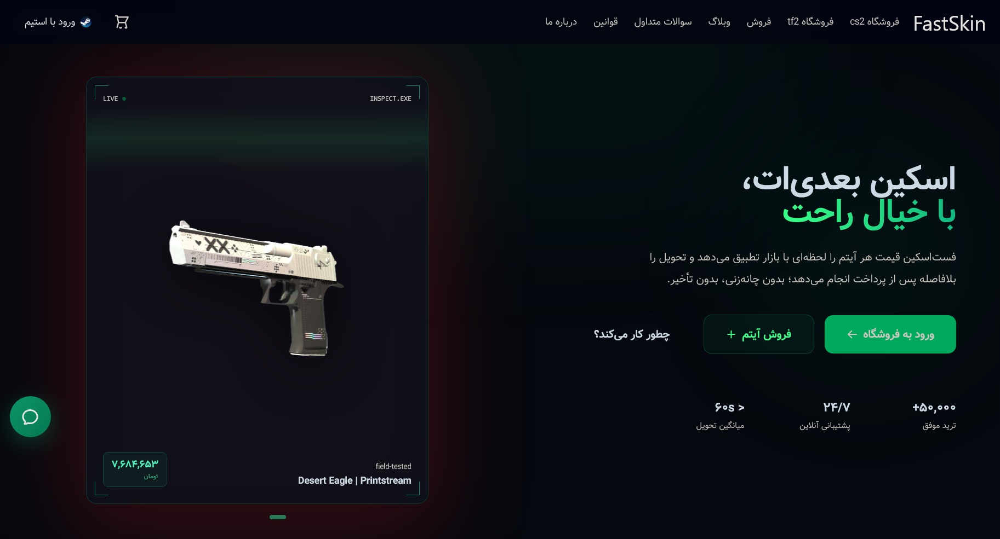
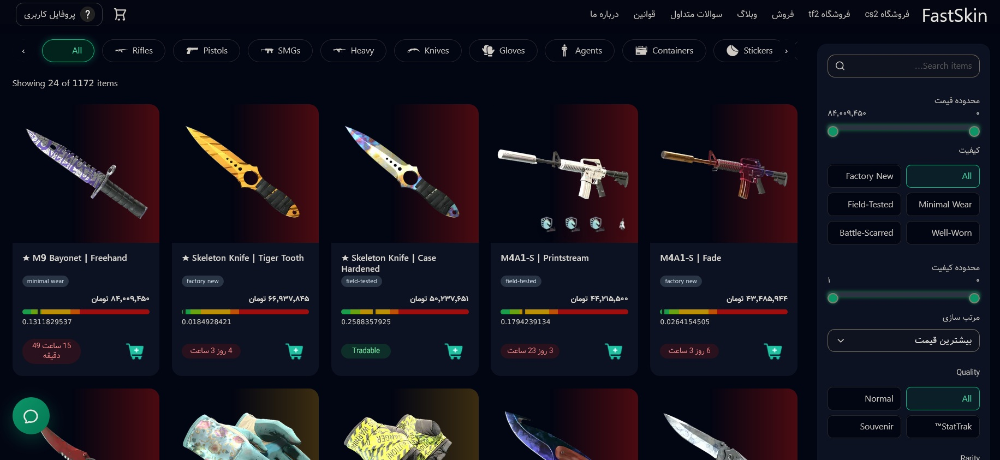
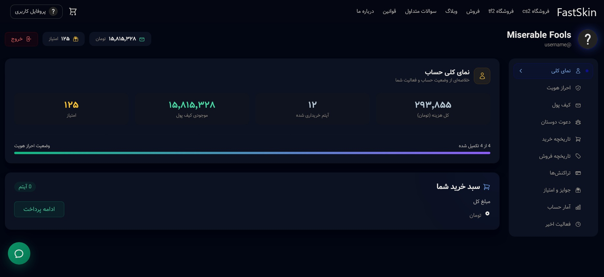
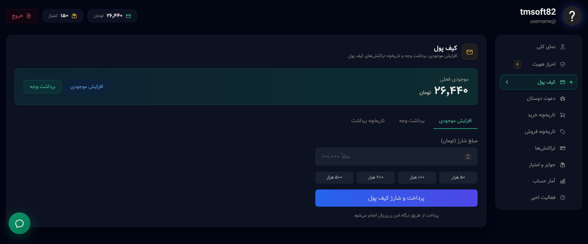
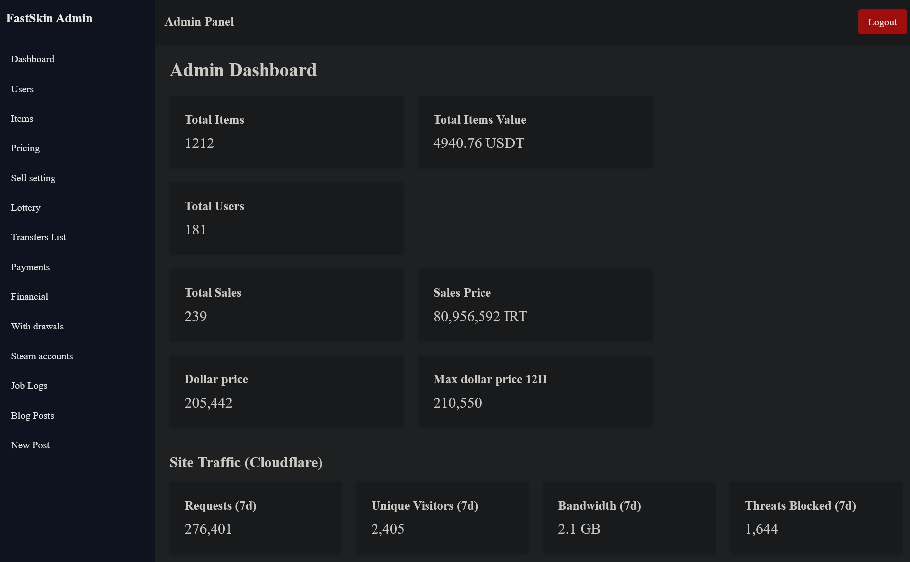

# FastSkin.ir

**FastSkin.ir** is a production-grade marketplace for **Counter-Strike 2 (CS2)** and **Team Fortress 2 (TF2)** items.

The platform provides a complete ecosystem for buying, selling, trading, analyzing, and managing game items. It combines a Next.js web application, React administration panel, PHP backend APIs, Node.js services and bots, automated Steam data collection, and an automated trading infrastructure.

🌐 Website: https://fastskin.ir/

---

## Overview

FastSkin is a multi-service platform built around game-item trading and marketplace infrastructure.

The platform includes:

* CS2 marketplace
* TF2 marketplace
* Buying and selling system
* Automated Steam trading
* Automated trade-offer delivery
* Steam market data collection
* Market price tracking
* Price history
* Market analytics
* User accounts and profiles
* Wallet and transaction system
* Referral system
* Lottery system
* Blog and content management system
* React administration panel
* Node.js bots and background services
* Automated data processing
* Steam-related services

The platform is designed to be largely independent of manual user-provided market information. Required market data is automatically collected, processed, and stored by backend services.

---

# Architecture

FastSkin is composed of several independent applications and services that communicate with each other through APIs and shared infrastructure.

```text
                         Steam Community
                               |
                               |
                        Data Collection
                               |
                               v
                    +----------------------+
                    |   Node.js Services   |
                    |   Scrapers / Bots    |
                    +----------+-----------+
                               |
                               v
                    +----------------------+
                    |      Database        |
                    | Market & User Data   |
                    +----------+-----------+
                               |
              +----------------+----------------+
              |                                 |
              v                                 v
      +---------------+                 +---------------+
      |   PHP Backend |                 | Market / Data |
      |      APIs     |                 |   Processing  |
      +-------+-------+                 +-------+-------+
              |                                 |
              +----------------+----------------+
                               |
                +--------------+--------------+
                |                             |
                v                             v
        +---------------+             +---------------+
        |    Next.js    |             | React Admin  |
        |  Web Platform |             |    Panel     |
        +---------------+             +---------------+
                |
                v
              Users
```

---

# Technology Stack

## Frontend

### Next.js

The main public-facing website is built with **Next.js**.

The frontend handles:

* Marketplace interface
* CS2 item browsing
* TF2 item browsing
* Item details
* Buying and selling flows
* User profiles
* Wallet interface
* Referral system
* Lottery interface
* Blog
* Market analytics
* Authentication
* Responsive UI

The frontend communicates with the backend through APIs rather than directly accessing the database.

---

## Admin Panel

A separate **React.js administration panel** is used for managing the platform.

The admin panel provides centralized tools for:

* User management
* Item management
* Orders
* Transactions
* Wallets
* Market data
* Price management
* Blog management
* Referral management
* Lottery management
* Trading operations
* Analytics
* System configuration

The separation between the public application and administration system allows internal operational tools to remain independent from the user-facing website.

---

# Backend

## PHP API

The primary application backend is implemented using **PHP**.

It handles the core business logic of the platform, including:

* Authentication
* User management
* Marketplace operations
* Buying and selling
* Orders
* Wallets
* Transactions
* Item management
* Market information
* Referral system
* Lottery system
* Blog APIs
* Administrative operations
* Trading workflows
* Security and authorization

The backend acts as the main business-logic layer between the frontend, database, trading infrastructure, and other services.

---

# Node.js Services & Bots

FastSkin uses several **Node.js services and bots** for tasks that require persistent processes, automation, or direct interaction with Steam-related systems.

These services are responsible for tasks such as:

* Steam-related automation
* Automated trade processing
* Trade-offer management
* Market data collection
* Background jobs
* Steam authentication-related services
* Automated bots
* Data processing
* Scheduled tasks
* Supporting marketplace operations

These services operate independently from the main PHP API and allow long-running processes to be handled separately.

---

# Automated Trading System

One of the core parts of FastSkin is its automated Steam trading infrastructure.

The platform operates multiple trading bots on its servers. These bots interact with Steam and automatically handle trade offers between FastSkin and users.

The trading infrastructure is responsible for workflows such as:

```text
User completes purchase
        |
        v
Backend validates transaction
        |
        v
Trading service selects inventory
        |
        v
Trading bot creates Steam trade offer
        |
        v
User receives trade offer
        |
        v
User accepts trade
        |
        v
Trade status is detected
        |
        v
Backend updates transaction
```

The same infrastructure can also be used for item-selling workflows:

```text
User wants to sell an item
        |
        v
Backend creates selling workflow
        |
        v
Trading bot sends / manages trade offer
        |
        v
User sends item to FastSkin
        |
        v
Bot detects incoming trade
        |
        v
Backend verifies received item
        |
        v
Transaction is updated
        |
        v
User balance is processed
```

The bots allow the platform to automate repetitive trading operations instead of requiring administrators to manually create and process every Steam trade.

This infrastructure is integrated with the marketplace backend so that trade status, transaction status, inventory state, and user balances can be synchronized.

---

# Steam Data Collection

FastSkin automatically collects and processes information from the **Steam Community website** and related publicly accessible Steam data sources.

The purpose of this system is to obtain the market information required by the platform without depending on users to manually provide it.

```text
Steam Community
       |
       v
Automated Collection
       |
       v
Parsing & Extraction
       |
       v
Data Normalization
       |
       v
Database
       |
       +------> Marketplace
       |
       +------> Market Analytics
       |
       +------> Price History
       |
       +------> Admin Dashboard
```

Depending on the data source, the system can process information such as:

* Item prices
* Buy orders
* Sell orders
* Market depth
* Trading volume
* Price history
* Market spread
* Buy/sell imbalance
* Item information
* Other market indicators

This information is then stored and processed by the platform's backend services.

---

# Market Analytics

FastSkin contains market-analysis functionality for CS2 items.

Market information can be used to calculate and display:

* Current market prices
* Historical prices
* Buy-side volume
* Sell-side volume
* Market depth
* Spread
* Price movement
* Nearby buy volume
* Nearby sell volume
* Market imbalance
* Market risk indicators

Historical price data is also maintained so that price movements can be analyzed over time.

---

# Marketplace

The marketplace is the core of FastSkin.

Users can buy and sell game items through the platform.

The marketplace includes:

* Item listings
* Buying
* Selling
* Pricing
* Orders
* Transactions
* Inventory management
* Automated trading
* Market information
* Price history
* Item history

The infrastructure is designed to support multiple game economies while keeping game-specific functionality separated where necessary.

---

# Supported Games

## Counter-Strike 2

FastSkin provides a marketplace and trading infrastructure for CS2 items.

Features include:

* CS2 skins
* Knives
* Gloves
* Item listings
* Buying
* Selling
* Automated trading
* Price tracking
* Market analytics
* Historical price data

## Team Fortress 2

FastSkin also supports **Team Fortress 2** items.

The platform currently includes TF2 marketplace functionality such as trading and selling commonly traded TF2 items.

---

# Wallet & Transactions

FastSkin includes an internal wallet and transaction infrastructure.

The wallet system manages:

* User balances
* Deposits
* Purchases
* Selling proceeds
* Balance changes
* Transaction history
* Administrative operations

Financial operations are handled by the backend rather than relying on frontend state.

---

# Referral System

FastSkin includes a built-in referral system.

Users can invite other users through referral links and receive rewards based on qualifying activity.

The system includes:

* Referral codes
* Referral links
* Referral tracking
* User relationships
* Reward calculation
* Referral statistics
* Administrative management

---

# Lottery System

The platform also contains an integrated lottery system.

The lottery infrastructure handles:

* Lottery creation
* User entries
* Participation
* Prize configuration
* Winner selection
* Lottery history
* Administrative controls

The lottery system is integrated with the existing user and transaction infrastructure.

---

# Blog System

FastSkin has its own blog and content management system.

The blog is used for publishing content related to:

* CS2
* TF2
* Skins
* Items
* Market information
* Guides
* News
* Updates
* Gaming-related topics

The administration panel provides tools for creating, editing, publishing, and managing articles.

---

# Screenshots

Screenshots of the production platform can be added below to demonstrate the different parts of the system.

## Main Website

### Homepage



### CS2 Marketplace




### User Profile



### Wallet



---

### Admin Dashboard



---

# Data & Trading Infrastructure

FastSkin combines automated market-data collection with automated trading.

```text
                    Steam
                      |
          +-----------+-----------+
          |                       |
          v                       v
    Market Data              Steam Trading
    Collection                  System
          |                       |
          v                       v
     Data Services          Trading Bots
          |                       |
          +-----------+-----------+
                      |
                      v
                  Backend
                      |
          +-----------+-----------+
          |                       |
          v                       v
      Marketplace            Admin Panel
          |
          v
        Users
```

This architecture allows market information and trading operations to be handled by dedicated services while the main backend coordinates users, transactions, orders, and business logic.

---

# Security

Security is an important part of the platform architecture.

The system includes backend-side controls for:

* Authentication
* Authorization
* Admin access
* API validation
* Transaction validation
* User permissions
* Sensitive data handling
* CORS configuration
* Session management
* Trading validation

Sensitive operations are performed server-side rather than trusting client-side state.

---

# Project Structure

A simplified representation of the FastSkin ecosystem:

```text
FastSkin
|
+-- frontend/
|   +-- Next.js
|
+-- admin/
|   +-- React.js
|
+-- backend/
|   +-- PHP API
|
+-- services/
|   +-- Node.js Bots
|   +-- Steam Services
|   +-- Data Collection
|   +-- Trading Services
|
+-- database/
|   +-- Marketplace Data
|   +-- User Data
|   +-- Transaction Data
|   +-- Market Data
|
+-- automation/
|   +-- Background Jobs
|   +-- Scheduled Tasks
|
+-- screenshots/
    +-- Website
    +-- Admin Panel
```

---

# Engineering Challenges

Developing FastSkin involves solving a number of real-world engineering problems:

* Designing a multi-application architecture
* Building a marketplace for multiple game economies
* Automating Steam data collection
* Processing large amounts of market information
* Maintaining historical price data
* Building automated Steam trading infrastructure
* Managing multiple trading bots
* Synchronizing trade status with backend transactions
* Designing secure transaction flows
* Connecting PHP, Node.js, React, and Next.js services
* Building scalable administration tools
* Running persistent background services
* Maintaining consistency between different services
* Building market-analysis functionality
* Handling automated inventory and trade operations

---

# Production Infrastructure

FastSkin is designed and operated as a real production platform rather than a simple demonstration project.

The ecosystem contains:

* Public web application
* Backend APIs
* React administration panel
* Node.js background services
* Steam data collection services
* Automated trading bots
* Database infrastructure
* Market analytics
* Wallet infrastructure
* Transaction processing
* Referral system
* Lottery system
* Blog and content management

Each component has a specific responsibility, allowing different parts of the platform to be developed and scaled independently.

---

# Development

FastSkin is continuously developed with a focus on:

* Performance
* Security
* Automation
* Scalability
* Maintainability
* User experience
* Market-data accuracy
* Trading reliability
* Operational efficiency

The project combines:

**Frontend Development + Backend Engineering + Database Design + API Development + Automation + Data Extraction + Steam Integration + Trading Infrastructure + Market Analytics**

into a single production ecosystem.

---

# Disclaimer

FastSkin is an independent platform and is not affiliated with or endorsed by Valve Corporation or Steam.

Steam and all related game and item trademarks belong to their respective owners.

Market information is collected from publicly accessible sources and processed for the functionality of the platform.

---

## FastSkin

**A multi-service marketplace, trading, and market-analysis platform for CS2 and TF2.**

**Technology:** Next.js · React.js · PHP · Node.js · MySQL · Steam Integration · Automation · Market Analytics
